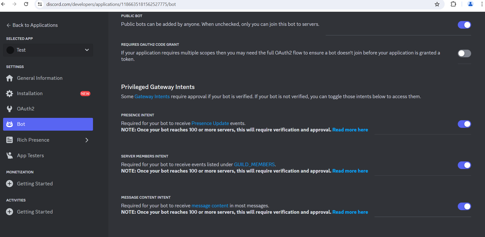

# Ticket-support by Discord

## Install engine

- [Node](https://nodejs.org/en/)
- [NPM](https://www.npmjs.com/)
  
## Step 1

In order to run the bot we need!

### Install

```bash
# Download the source code to your computer

git clone https://github.com/Myrchuk21/Ticket-Support

# Go to the folder

cd Tciket-Support/

# Intall modules

npm install
```

## Step 2

**Don't forget the token:** After creating the bot, enable `applications.commands` then enable `OAuth2` go to [developer portal](https://discord.com/developers/applications/).



## Step 3

go to config.js and configuriren ur prefix 

```
# Setup

Ur prefix /setup (qf!setup)

# Test online

Ur prefix /ping (qf!ping)
```


## Bot status

```
// Accepted activity types

ActivityType.Playing
ActivityType.Listening
ActivityType.Watching
ActivityType.Competing
ActivityType.Streaming // Lets you use url parameter. This can be a YouTube or Twitch link.
ActivityType.Custom // Unsupported in discord.js. Will be added at some point.

// Accepted statusses
"online"
"offline"
"idle"
"dnd"
```
